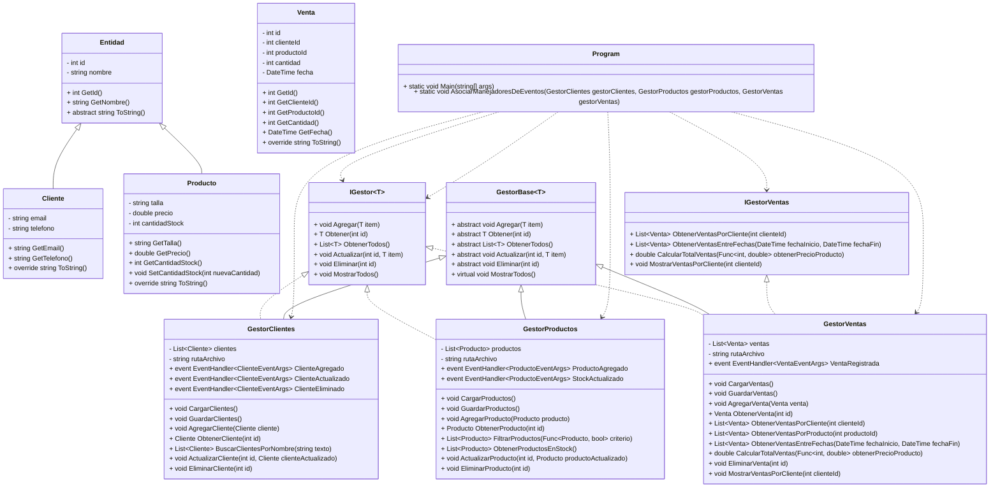

# Diagrama UML - Tienda de Ropa Deportiva

## Descripción general
Este diagrama muestra las clases principales del proyecto, sus relaciones de herencia, las interfaces utilizadas y las dependencias principales.

## Diagrama de clases (Mermaid)

## Relaciones clave
- `Cliente` y `Producto` heredan de `Entidad`.
- `GestorBase<T>` implementa `IGestor<T>` y proporciona la base común de CRUD.
- `GestorClientes`, `GestorProductos` y `GestorVentas` extienden `GestorBase<T>`.
- `GestorVentas` implementa además `IGestorVentas` para lógica de ventas específica.
- `Program` usa DI con Castle Windsor para resolver gestores y conecta el flujo de la aplicación.
- Los gestores de datos persisten en CSV (`Clientes.csv`, `Productos.csv`, `Ventas.csv`).

## Nota
El diagrama expresa tanto arquitectura de clases como las dependencias principales del programa.
